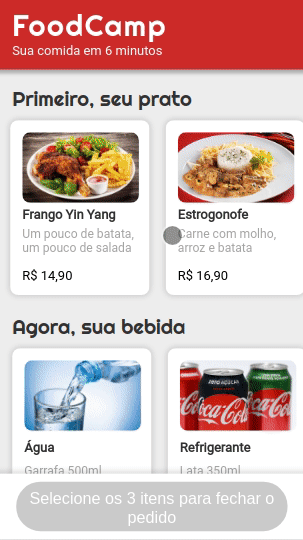

# DrivenEats

The app allows you to easily choose your combo (dish, drink and dessert), then send the order via WhatsApp directly to the restaurant.



Try it out now at https://driven-eats.vercel.app/

## About

This is a web application where you choose your complete meal from the available menu. Below are the implemented features:

- List all dishes, drinks and desserts
- Select one or more options
- Close the order if all three options have been selected
- Review order before confirmation
- Confirm order and send directly to the restaurant via Whatsapp

## Technologies
The following tools and frameworks were used in the construction of the project:<br>

&nbsp;
  &nbsp;
  &nbsp;
  &nbsp;
  &nbsp;
  &nbsp;
  
## How to run

1. Clone this repository
2. Install dependencies
```bash
npm i
```
6. Run with
```bash
npm start
```
7. You can optionally build the project running
```bash
npm run build
```
8. Finally access http://localhost:3000 on your favorite browser (unless it is Internet Explorer. In this case, review your life decisions)